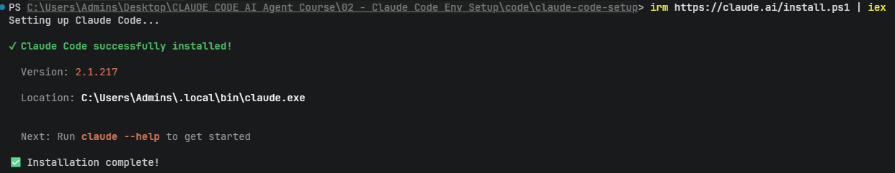

# 🚀 Hướng Dẫn Cài Đặt Claude Code CLI

Tài liệu này hướng dẫn chi tiết từng bước để cài đặt công cụ **Claude Code CLI** trên hệ điều hành Windows dành cho người mới bắt đầu.

---

## 1. Claude Code CLI là gì?

**Claude Code** là công cụ AI Agent dạng dòng lệnh (Command Line Interface - CLI) chính thức phát triển bởi Anthropic. Công cụ này hoạt động trực tiếp trong cửa sổ Terminal / PowerShell của bạn để:

- 🤖 **Tự động hóa lập trình**: Viết code mới, refactor code cũ, và sửa lỗi (debug) thông minh.
- 🔍 **Đọc & Hiểu dự án**: Phân tích toàn bộ cấu trúc file, hàm và mã nguồn trong workspace.
- 🛠️ **Chạy câu lệnh hệ thống**: Tự động thực thi lệnh build, test, hoặc git trực tiếp.

---

## 2. Yêu Cầu Tiền Đề

Để cài đặt Claude Code CLI, máy tính của bạn cần đáp ứng:

| Yêu cầu | Mô tả |
| :--- | :--- |
| **Hệ điều hành** | Windows 10 hoặc Windows 11 |
| **Ứng dụng** | Windows PowerShell (tích hợp sẵn trên Windows) |

---

## 3. Các Bước Cài Đặt Chi Tiết

### Bước 1: Mở cửa sổ PowerShell
1. Nhấn phím `Windows` trên bàn phím.
2. Gõ từ khóa **PowerShell**.
3. Nhấp chọn **Windows PowerShell** (hoặc Windows Terminal).

### Bước 2: Thực thi lệnh cài đặt tự động
Copy câu lệnh PowerShell bên dưới, dán vào cửa sổ PowerShell và nhấn **Enter**:

```powershell
irm https://claude.ai/install.ps1 | iex
```

> [!NOTE]
> **Giải thích câu lệnh đơn giản:**
> - `irm` (`Invoke-RestMethod`): Tải script cài đặt an toàn từ trang chủ Anthropic (`claude.ai`).
> - `| iex` (`Invoke-Expression`): Chạy script cài đặt tự động ngay trên máy tính của bạn.

---

## 4. Kiểm Tra Kết Quả Cài Đặt

Sau khi lệnh chạy hoàn tất, màn hình PowerShell sẽ hiển thị xác nhận:



Các thông tin quan trọng hiển thị trên màn hình:

- ✅ `✔ Claude Code successfully installed!`: Đã cài đặt thành công.
- 📌 `Version: 2.1.217` (hoặc phiên bản mới hơn): Phiên bản Claude Code.
- 📁 `Location: C:\Users\<Username>\.local\bin\claude.exe`: Vị trí lưu file thực thi.

Để kiểm tra trợ giúp và danh sách câu lệnh, bạn gõ:
```powershell
claude --help
```

---

## 5. Mẹo & Xử Lý Sự Cố Thường Gặp

> [!IMPORTANT]
> **Lỗi không nhận diện lệnh `claude` (`'claude' is not recognized...`):**
> Sau khi cài xong, nếu bạn gõ `claude` mà gặp thông báo lỗi trên, nguyên nhân là do cửa sổ PowerShell cũ chưa cập nhật biến môi trường `PATH`.
> 👉 **Cách xử lý**: Bạn chỉ cần **ĐÓNG HẲN** cửa sổ PowerShell hiện tại và **MỞ LẠI** một cửa sổ PowerShell mới.

> [!TIP]
> Bạn nên kết hợp sử dụng **Claude Code CLI** với **Claude Code Router (CCR)** để chuyển đổi giữa các mô hình AI khác nhau (như DeepSeek, Qwen) giúp tối ưu hóa chi phí! Xem chi tiết tại bài hướng dẫn tiếp theo: [01-claude-code-router.md](./01-claude-code-router.md).

---

## 🔗 6. Tài Liệu Tham Khảo & Đường Dẫn Tải Về (References)

| Tài nguyên | Đường dẫn (URL) |
| :--- | :--- |
| 📖 **Trang tài liệu cài đặt chính thức** | [code.claude.com/docs/en/setup](https://code.claude.com/docs/en/setup) |
| 💻 **Script cài đặt Windows (PowerShell)** | [claude.ai/install.ps1](https://claude.ai/install.ps1) |
| 🌐 **Trang chủ Anthropic Claude** | [claude.ai](https://claude.ai/) |
| 📚 **Anthropic Claude Code Docs** | [docs.anthropic.com](https://docs.anthropic.com/) |