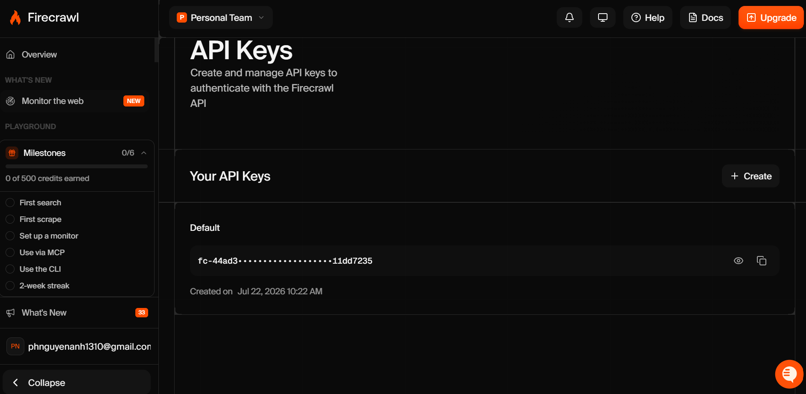
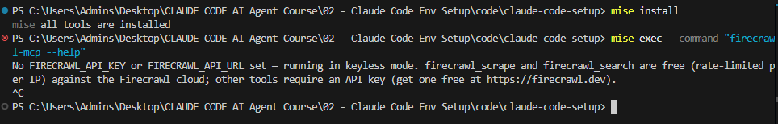

# 🔌 Hướng Dẫn Tích Hợp Firecrawl MCP Server Cho Claude Code

Tài liệu này hướng dẫn chi tiết từng bước tích hợp **Firecrawl MCP Server** vào công cụ **Claude Code CLI** cùng với **Firecrawl API Key**, giúp AI Agent thực hiện các tác vụ cào dữ liệu web (scraping), crawl website và trích xuất nội dung thông minh.

Do sử dụng Minimax nên MCP này là **BẮT BUỘC** để claude search tốt.

---

## 1. Đăng Ký & Lấy Firecrawl API Key

Để Firecrawl MCP Server hoạt động được, bạn cần có API Key từ Firecrawl:

1. Truy cập trang chủ Firecrawl tại [firecrawl.dev](https://www.firecrawl.dev/).
2. Đăng ký/Đăng nhập tài khoản và di chuyển đến mục **API Keys** trên Dashboard.
3. Nhấn **Create API Key** và sao chép mã Key (dạng `fc-xxxxxxxxxxxxxxxx`).



---

## 2. Thêm Firecrawl MCP Vào File `mise.toml`

Mở file `mise.toml` ở thư mục gốc của dự án và thêm gói npm `firecrawl-mcp` vào khối `[tools]`:

```toml
# mise configuration — https://mise.jdx.dev
# Áp dụng cho riêng thư mục dự án này.

[tools]
# 1. Python & Node.js
python = "3.13"
node = "lts"

# 2. Firecrawl MCP Server — Công cụ thu thập dữ liệu web cho AI Agent
# GitHub Repository: https://github.com/firecrawl/firecrawl-mcp-server
"npm:firecrawl-mcp" = "latest"

[env]
# Tự động tạo và kích hoạt môi trường ảo Python tại thư mục .venv
_.python.venv = { path = ".venv", create = true }
```

Sau khi lưu file `mise.toml`, chạy lệnh sau trong terminal để Mise tự động tải và cài đặt binary `firecrawl-mcp`:

```bash
mise install
```

---

## 3. Cấu Hình MCP Server Trong File `.mcp.json`

Tạo hoặc cập nhật file `.mcp.json` nằm tại thư mục gốc của dự án. Khai báo thông tin server `firecrawl` cùng biến môi trường `FIRECRAWL_API_KEY`:

```json
{
  "mcpServers": {
    "firecrawl": {
      "command": "firecrawl-mcp",
      "args": [],
      "env": {
        "FIRECRAWL_API_KEY": "<YOUR_FIRECRAWL_API_KEY>"
      }
    }
  }
}
```

> [!IMPORTANT]
> **Lưu ý về API Key:**
> Thay thế `<YOUR_FIRECRAWL_API_KEY>` bằng mã API Key thực tế của bạn thu được ở Bước 1.

---

## 4. Kiểm Tra & Xác Minh Kết Nối

### Bước 1: Kiểm tra lệnh CLI trong terminal

Chạy lệnh kiểm tra giao diện trợ giúp của Firecrawl MCP CLI:

```bash
# Sử dụng --command với mise exec
mise exec --command "firecrawl-mcp --help"
```

Màn hình sẽ hiển thị giao diện trợ giúp của Firecrawl MCP CLI:



### Bước 2: Kiểm tra trong Claude Code CLI (TUI)

1. Mở terminal tại thư mục dự án và khởi động Claude Code:
   ```bash
   claude
   ```
2. Trong giao diện Claude Code, gõ câu lệnh slash:
   ```text
   /mcp
   ```
3. Màn hình sẽ liệt kê các MCP Servers đang active. Xác nhận server `firecrawl` hiển thị ở trạng thái **Connected**.

> [!IMPORTANT]
> **MCP báo `firecrawl` disconnected mặc dù mọi thứ đúng?** Nguyên nhân phổ biến nhất: `${FIRECRAWL_API_KEY}` trong `.mcp.json` chỉ thay thế được nếu biến này có trong env của **process Claude Code** — và process đó kế thừa env từ shell cha. Mặc định shell **không tự load `.env`**; chỉ khi `mise` đang **active** (qua `mise activate` hoặc `mise exec`) thì khai báo `_.file = ".env"` trong `mise.toml` mới có hiệu lực.
>
> **Fix nhanh — không cần đụng profile:**
> ```bash
> mise exec -- claude
> ```
> `mise exec` áp dụng toàn bộ `[env]` từ `mise.toml` (kể cả `_.file = ".env"`) cho process con, rồi chạy `claude`. Đây là cách gọn nhất cho fresh install.
>
> **Hoặc — activate mise trong shell rồi gõ `claude` bình thường** (xem [`docs/0-init/01-mise.md` § 2.3](../../0-init/01-mise.md)):
> ```powershell
> # PowerShell
> mise activate pwsh | Out-String | Invoke-Expression
> ```
> ```bash
> # bash / zsh
> eval "$(mise activate bash)"   # hoặc: eval "$(mise activate zsh)"
> ```
>
> Kiểm tra nhanh key đã có trong shell chưa:
> ```bash
> echo "$FIRECRAWL_API_KEY"   # hoặc: $env:FIRECRAWL_API_KEY trên PowerShell
> ```
> Rỗng → `.env` chưa được load → dùng `mise exec -- claude`.

---

## 🔗 5. Tài Liệu Tham Khảo (References)

| Tài nguyên | Đường dẫn (URL) |
| :--- | :--- |
| 🔥 **Firecrawl Official Website** | [firecrawl.dev](https://www.firecrawl.dev/) |
| 🔑 **Firecrawl API Keys Dashboard** | [firecrawl.dev/app/api-keys](https://www.firecrawl.dev/app/api-keys) |
| 🐙 **Firecrawl MCP Server GitHub** | [github.com/firecrawl/firecrawl-mcp-server](https://github.com/firecrawl/firecrawl-mcp-server) |
| 📦 **Firecrawl MCP npm Package** | [npmjs.com/package/firecrawl-mcp](https://www.npmjs.com/package/firecrawl-mcp) |
| 🤖 **Anthropic MCP Docs** | [modelcontextprotocol.io](https://modelcontextprotocol.io/) |
