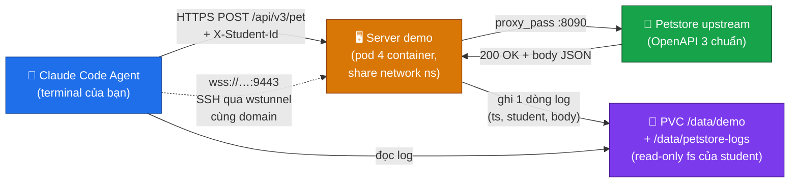
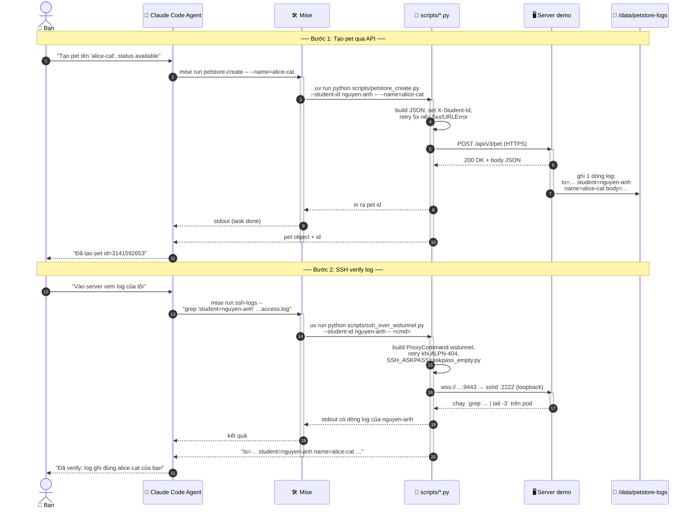

# 🌐 Kết Nối Server Demo Qua Mise — Petstore API + SSH-qua-wstunnel

Tài liệu này hướng dẫn dùng **Mise** để chạm vào **server demo public** phục vụ
bài tập: gọi **Petstore API thật** rồi **SSH vào kiểm tra log**.
Toàn bộ runtime (`wstunnel`, `ssh`, `python`) đến từ `mise install` — không
cần cài gì riêng lẻ ngoài hệ thống.

---

## 1. Server Demo Là Gì?

Là một **pod "giống VPS"** chạy công khai trên cụm Kubernetes nội bộ, expose
qua 2 domain:

| Flow | Domain (public, port `9443` bắt buộc) | Mục đích |
| :--- | :--- | :--- |
| **API** | `petstore-ai-course-demo.sandbox.vnpt-technology.vn` | Gọi Petstore API mẫu (`POST /api/v3/pet`) — đi qua Ingress bình thường |
| **SSH** | `passthrough-ai-course-demo-ssh.sandbox.vnpt-technology.vn` | SSH vào xem log — qua `wstunnel` WebSocket tunnel, wstunnel **tự terminate TLS** (kiến trúc v2, 2026-07-23) |


Header `X-Student-Id: <tên-bạn>` **bắt buộc** cho mọi request API —
mỗi request (kèm body) được ghi vào log riêng theo `student=<id>` để
nhiều học viên dùng chung không trộn dòng của nhau.

---

## 2. Cấu Hình & Điều Kiện Tiên Quyết

### 2.1. Mise đã cài

Nếu chưa có, xem [`docs/0-init/01-mise.md`](../0-init/01-mise.md).

### 2.2. `mise install` đã chạy

Sẽ pull về 8 tool: `python`, `node`, `firecrawl-mcp`, `uv`, `docling`,
`gitleaks`, `gh`, **`wstunnel`**. Tool cuối cùng mới được thêm — đây là
client WebSocket tunnel dùng cho SSH qua HTTPS.

```bash
mise install
```

### 2.3. OpenSSH client

`wstunnel` cung cấp tunnel; còn lệnh `ssh` (kèm `ProxyCommand`) đến từ hệ
điều hành:

| OS | Có sẵn? |
| :--- | :--- |
| macOS | ✅ (cài qua Xcode CLI tools nếu chưa có) |
| Linux | ✅ (gói `openssh-client`) |
| Windows 10+ | ⚠️ cài **OpenSSH Client** qua *Settings → Apps → Optional Features* hoặc `Add-WindowsCapability -Online -Name OpenSSH.Client~~~~0.0.1.0` |

### 2.4. Khai báo `X-Student-Id` trong `.env`

```bash
cp .env.example .env
echo 'PETSTORE_STUDENT_ID=nguyen-anh' >> .env
```

`PETSTORE_STUDENT_ID` sẽ tự động load nhờ `_.file = ".env"` đã có sẵn
trong `mise.toml`. Đặt 1 lần, cả 2 task bên dưới dùng chung.

> [!NOTE]
> Hai URL mặc định (`PETSTORE_BASE_URL`, `PETSTORE_WSS_URL`) đã có sẵn
> trong `mise.toml [env]`. Chỉ override khi server demo chuyển địa chỉ.

### 2.5. ⚠️ Không dùng được khi ngồi trong mạng nội bộ VNPT Technology — dùng 4G/5G để test

> [!WARNING]
> **Trạng thái (2026-07-24):** khi ngồi trong VPN nội bộ VNPT Technology
> (máy tính công ty cấp), cả 2 flow đều trả `404` dù script + upstream
> vẫn sống. Nguyên nhân: DNS adapter của VPN trả `*.sandbox.vnpt-technology.vn`
> về IP private (`cp-01: 10.15.17.146`) thay vì IP public qua VM
> `10.15.94.54`. Đi đường nội bộ, route trên cụm chưa map đúng cho
> tên miền public (ingress chỉ được whitelist cho IP public).
>
> **Hiện chưa hoạt động** khi dùng mạng nội bộ VNPT Tech — có thể được
> fix vào **sáng mai**. Trong thời gian chờ fix, **khuyến nghị dùng
> 4G/5G** (chia sẻ từ điện thoại hoặc USB tethering) khi test.
>
> Triệu chứng để biết mình đang bị:
>
> | Dấu hiệu | Nguyên nhân |
> | :--- | :--- |
> | `mise run petstore-create` → `FAIL: server trả 404` (mọi lần thử) | Đi qua VPN nội bộ, route ingress chưa map |
> | `Resolve-DnsName petstore-ai-course-demo.sandbox.vnpt-technology.vn` → trả `10.15.17.146` | DNS VPN override (đáng báo) |
> | `curl ... -v` thấy `Connected to ... (10.15.17.146)` | Đi đường nội bộ, không qua VM public-proxy |

**Cách xử lý tạm (1 trong 2):**

```powershell
# Cách A: tắt VPN công ty + dùng 4G/5G (KHUYẾN NGHỊ)
# Bật 4G trên điện thoại, USB tether với máy, tắt VPN Cisco AnyConnect/...
# Sau đó chạy lại:
mise run petstore-create
mise run ssh-logs -- "tail -3 /data/petstore-logs/access.log"

# Cách B: ép DNS qua 8.8.8.8 (chỉ áp dụng cho 1 phiên terminal,
# KHÔNG thay đổi adapter mạng hệ thống)
Resolve-DnsName petstore-ai-course-demo.sandbox.vnpt-technology.vn -Server 8.8.8.8
#   → phải trả IP public (không phải 10.x.x.x)
# Rồi dùng IP đó với --resolve trong curl:
curl --resolve petstore-ai-course-demo.sandbox.vnpt-technology.vn:9443:<IP-PUBLIC> `
     -i -X POST "https://petstore-ai-course-demo.sandbox.vnpt-technology.vn:9443/api/v3/pet" `
     -H "Content-Type: application/json" -H "X-Student-Id: nguyen-anh" `
     -k -d '{"id":111,"name":"probe","photoUrls":[],"status":"available"}'
```

> [!NOTE]
> Script `petstore_create.py`/`ssh_over_wstunnel.py` không đụng DNS —
> chúng dùng resolver của hệ điều hành. Nghĩa là nếu bạn VPN mà không
> ép DNS, **chạy `mise run ...` sẽ tự động đi đường nội bộ**. Hãy nhớ
> flag này khi điều tra bug liên quan tới mạng.

---

## 3. Flow 1 — Gọi Petstore API

Đơn giản nhất: gọi `POST /api/v3/pet` với header `X-Student-Id`.

```bash
mise run petstore-create
```

**Kết quả mong đợi:**

```text
OK  (200) sau 1 lần thử
{
  "id": 3141592653,
  "name": "nguyen-anh-fluffy-1a2b3c",
  "photoUrls": ["https://example.com/pet.jpg"],
  "tags": [{"name": "nguyen-anh"}],
  "status": "available"
}
```

### 3.1. Tuỳ chọn

| Tuỳ chọn | Mô tả |
| :--- | :--- |
| `--student-id=<id>` | Ghi đè `$PETSTORE_STUDENT_ID` cho lần gọi này |
| `--name=<tên>` | Đặt tên pet (mặc định: `<student>-fluffy-<random>`) |
| `--tag=<tag>` | Đặt tag (mặc định: `<student>`) |

Ví dụ:

```bash
mise run petstore-create -- --name=demo-cat --tag=demo-batch-01
```

> [!NOTE]
> **Giải thích script** (`scripts/petstore_create.py`):
> - Body JSON tự build theo schema Swagger Petstore: `id`, `name`, `photoUrls[]`, `tags[]`, `status`.
> - Tắt SSL verify vì demo dùng cert tự ký (chỉ dùng cho server này).
> - Retry 5 lần exponential backoff (0.5→1→2→4→8s) trên 5xx hoặc lỗi mạng.
> - In status code + body đẹp ra stdout; thất bại → thoát code 1, lỗi rõ trên stderr.

---

## 4. Flow 2 — SSH Qua wstunnel Để Xem Log

Sau khi gọi API ở Flow 1, **mỗi request được log lại** trên server. SSH vào đọc:

```bash
mise run ssh-logs -- ls /data/petstore-logs
mise run ssh-logs -- tail -5 /data/petstore-logs/access.log
```

Filter đúng dòng của mình:

```bash
mise run ssh-logs -- "grep 'student=nguyen-anh' /data/petstore-logs/access.log"
```

### 4.1. Cơ chế hoạt động (kiến trúc v2 — TLS Passthrough, 2026-07-23)

```
┌──── Học viên (máy local) ──────────────────────────────────────────┐
│ mise run ssh-logs -- <lệnh>                                       │
│   └─ uv run python scripts/ssh_over_wstunnel.py                   │
│        ├─ SSH_ASKPASS=askpass_empty.py  (feed password trống)     │
│        ├─ ssh  (OpenSSH)                                           │
│        │    └─ ProxyCommand = wstunnel client ...                 │
│        │         └─ wss://passthrough-ai-course-demo-ssh.         │
│        │            sandbox.vnpt-technology.vn:9443               │
└───────────────────────────────────────────────────────────────────┘
```

> [!NOTE]
> **Giải thích script** (`scripts/ssh_over_wstunnel.py`):
> - `wstunnel` **tự terminate TLS** (mount cert wildcard `*.sandbox.vnpt-technology.vn`
>   từ `sandbox-wildcard-tls`), KHÔNG qua ingress-nginx.
> - Spawn `ssh` với `ProxyCommand` trỏ tới `wstunnel`.
> - `SSH_ASKPASS_REQUIRE=force` + `SSH_ASKPASS=scripts/askpass_empty.py`
>   tự feed password trống (không prompt tay, chạy được trong pipeline).
> - **Retry 5 lần** khi `ssh` thoát 255 — đây là triệu chứng bug
>   VM public-proxy `10.15.94.54` (L4 SNI-inspect) ngẫu nhiên RST trên
>   đường internet thật. Retry đủ để vào được trong >99% trường hợp
>   (xem § `Known issue` § 6 bên dưới).
> - SIGINT (`Ctrl+C`) → thoát code 130, wstunnel được kill sạch.

---

## 5. Kiểm Tra & Xác Minh

> [!TIP]
> **Smoke test nhanh trước khi thử log thật:**
> ```bash
> mise run ssh-logs -- uname -a
> ```
> Lệnh này chỉ in tên kernel (không phụ thuộc log), output ổn định — dùng để
> xác nhận cả pipeline `wstunnel → ssh → server demo` còn sống.

### 5.1. Sequence kiểm tra đầy đủ

```bash
# 1. mise đã cài wstunnel?
mise ls | grep wstunnel

# 2. tasks có 2 entry mới?
mise tasks ls

# 3. env đã load từ .env?
mise env | grep PETSTORE_STUDENT_ID

# 4. flow API hoạt động?
mise run petstore-create                    # → in ra pet vừa tạo

# 5. flow SSH hoạt động?
mise run ssh-logs -- uname -a              # → in tên kernel server
mise run ssh-logs -- ls /data/petstore-logs
mise run ssh-logs -- "grep 'student=nguyen-anh' /data/petstore-logs/access.log | tail -3"
```

### 5.2. Negative tests

| Tình huống | Kết quả mong đợi |
| :--- | :--- |
| `PETSTORE_STUDENT_ID` rỗng | Script in `LỖI: biến môi trường PETSTORE_STUDENT_ID chưa được set.` và thoát 2 |
| `mise install` chưa chạy | Script in `LỖI: không tìm thấy wstunnel`, bảo chạy `mise install` |
| `ssh` chưa cài (Windows) | Script in `LỖI: không tìm thấy ssh`, hướng dẫn cài OpenSSH Client |
| ALPN-404 liên tiếp | Script retry, lần đầu chậm nhất ~15s; nếu đến lần 5 vẫn fail → in lỗi rõ |

---

## 6. Mẹo & Xử Lý Sự Cố

| Triệu chứng | Nguyên nhân | Cách xử lý |
| :--- | :--- | :--- |
| `wstunnel asset not found` khi `mise install` | Release mới có thêm OS/arch chưa có trong regex | Mở `mise.toml`, bổ sung arch vào `matching_regex` |
| `Petstore connection refused` | Mạng nội bộ chặn `:9443`, hoặc cluster demo tạm ngưng | Thử ping domain; hỏi operator cluster |
| `X-Student-Id required` | Server trả 400 vì header thiếu | `mise env \| grep PETSTORE_STUDENT_ID` xem `.env` đã load chưa |
| ALPN-404 lặp > 5 lần | `use-http2` của ingress-nginx dao động | Thử lại sau 30s; known issue ở § bên dưới |
| `permission denied` khi chạy `askpass_empty.py` trên Linux/macOS | Script không có bit +x | `chmod +x scripts/askpass_empty.py` (không bắt buộc — ssh gọi qua interpreter cũng được, nhưng cảnh báo này cho bạn biết hệ thống kiểm tra) |
| `ssh: Could not resolve hostname localhost` trên Windows | OpenSSH Client chưa bật | `Add-WindowsCapability -Online -Name OpenSSH.Client~~~~0.0.1.0` rồi mở terminal mới |

### Known issue — `404` ngẫu nhiên qua domain public SSH

**Trạng thái (2026-07-23):** kiến trúc đã đổi sang v2 — wstunnel **tự terminate
TLS** đi qua Envoy Gateway TLS passthrough (listener `tls-passthrough`, port
4443), hoàn toàn **bỏ ingress-nginx khỏi đường SSH**. Hostname public bây giờ
là `passthrough-ai-course-demo-ssh.sandbox.vnpt-technology.vn:9443` (xem
`PETSTORE_WSS_URL` trong `mise.toml`).

**Bug vẫn còn:** dù đã bỏ ingress-nginx/ALPN, kết nối SSH-qua-wstunnel đi
qua **VM public-proxy `10.15.94.54`** (đường internet thật `:9443`) thỉnh
thoảng vẫn trả `404`. Cô lập bằng cách tách từng hop:

- Đi thẳng `cp-01:443` (bỏ qua VM public-proxy) → wstunnel tự TLS connect
  **sạch, không bao giờ lỗi**.
- Đi qua VM public-proxy → vẫn `404` ngẫu nhiên (cùng request mà `curl` qua
  hostname/port đó thành công).

Kết luận: bug thật nằm ở VM public-proxy (`10.15.94.54`, vai trò
SNI-inspect L4 theo ADR-0008) — một mảnh hạ tầng **chung toàn platform**,
quản lý bởi Ansible role `public_proxy_configure` riêng, **chưa đọc/đụng**.
Retry `ssh` là cách giảm thiểu tạm. Petstore API (đi qua Ingress
bình thường, không qua VM public-proxy theo đường `passthrough-`) **không bị
ảnh hưởng** bởi bug này.

---

## 7. Flow End-to-End Cho Một Bài Tập Hoàn Chỉnh

Phần này để bạn hiểu **toàn bộ hành trình một yêu cầu "tạo pet rồi xác minh
qua log"** — biết điều này, Agent (Claude Code) chạy đúng ngay từ lần đầu
mà không cần đoán.

### 7.1. Bốn bên tham gia



| Bên | Vai trò trong flow |
| :--- | :--- |
| **Agent** | Nhận yêu cầu của bạn (ví dụ: *"tạo pet tên `fluffy` cho tôi, status `available`"*). Chọn đúng tool, build JSON, gọi Petstore. Đọc log để xác nhận. |
| **Server demo** | Proxy + logger. Khi Petstore proxy thấy request, ghi **một dòng log** vào PVC: timestamp, student, IP, method, path, status, **toàn bộ body request**. |
| **Petstore upstream** | Standard `swaggerapi/petstore3` trả `200` nếu body đúng schema. |
| **PVC `/data/demo` & `/data/petstore-logs`** | Read-only filesystem của user `student` — đây là nơi Agent đọc log về. |

### 7.2. Hành trình 1 request, theo từng bước



> [!NOTE]
> **Điểm mấu chốt**: Agent **không cần biết** URL, port, header convention,
> cách build body, retry hay login không password. Tất cả đã được **mã hoá
> vào `mise.toml` + script**. Bạn chỉ cần gọi `mise run <task>`.

### 7.3. Tại sao dùng Mise + script tốt hơn `curl`/`ssh` thuần cho Agent?

| Tình huống | Agent gọi `curl`/`ssh` trực tiếp | Agent gọi qua `mise run` |
| :--- | :--- | :--- |
| **Cài binary** | Phải nhớ `apt install openssh-client`, `winget install wstunnel`, quản lý PATH trên Windows. Nhiều lần Agent quên hoặc gõ sai → fail. | `mise install` xong là xong — `wstunnel` có sẵn trên PATH cho mọi shell, mọi OS. |
| **Header convention** | Phải tự nhớ `-H "X-Student-Id: …"`. Agent có thể quên → server ghi log với student=`(unknown)`, bạn không lọc được. | `PETSTORE_STUDENT_ID` đã set trong `.env`, script tự gắn vào mọi request. |
| **SSL cert tự ký** | Agent phải nhớ `-k` hoặc `curl --insecure`; nếu quên → fail với `SSL: CERTIFICATE_VERIFY_FAILED`. | Script tắt verify đúng chỗ (chỉ cho domain demo). |
| **Body Petstore** | Agent phải nhớ schema (`id`, `name`, `photoUrls[]`, `tags[]`, `status`) và generate random id. Dễ sai field. | Script tự build đúng schema, random id ổn định. |
| **Retry ALPN-404** | Agent thấy 1 lần 404 thường dừng, báo lỗi → bạn phải tự bảo "thử lại". | Script retry 5 lần exponential backoff trước khi báo lỗi. |
| **Password trống cho ssh** | Agent phải biết `sshpass` hoặc dùng `-o PasswordAuthentication=yes` + nhập tay → không chạy được trong pipeline. | `SSH_ASKPASS` + `askpass_empty.py` tự feed, không prompt. |
| **Reproducibility** | Agent mỗi lần gõ `curl`/`ssh` lại có thể khác (URL, flag, header). Không audit được. | `mise.toml` + scripts là **source of truth** — pull request thay đổi được review như code. |
| **Cross-platform** | `wstunnel` khác binary mỗi OS; Agent phải tự chọn đúng file trên GitHub Releases. | Mise tự chọn đúng asset qua `matching_regex`. |
| **Đọc log** | Agent phải nhớ `ssh -o ProxyCommand='wstunnel …' -p 2222 student@…` — cú pháp dài, dễ typo. | Một dòng `mise run ssh-logs -- cat …` — Agent focus vào **lệnh cần chạy**, không phải plumbing. |

> [!TIP]
> **Nguyên tắc:** Agent càng ít phải "nhớ" thì càng ít sai. Mise đóng gói
> mọi thứ vào `mise.toml` + script — giống như Dockerfile cho dev environment,
> nhưng cho command.

### 7.4. Câu lệnh đầy đủ để Agent chạy demo

```bash
# Lần đầu (1 phút):
mise install
echo 'PETSTORE_STUDENT_ID=nguyen-anh' >> .env

# Hỏi Agent:
"Hãy tạo 1 pet tên 'fluffy-cat' cho tôi, status available,
 rồi SSH vào server grep log để xác nhận đã ghi đúng."
```

Agent chỉ cần 2 lệnh sau để hoàn thành yêu cầu:

```bash
mise run petstore-create -- --name=fluffy-cat
mise run ssh-logs -- "grep 'student=nguyen-anh' /data/petstore-logs/access.log | tail -3"
```

Không có URL, header, port, password, retry nào Agent phải tự nhớ.

> [!WARNING]
> **Cả 2 flow đều cần đường public.** Nếu bạn đang ngồi trong VPN công ty,
> DNS adapter mạng có thể trả IP private (`cp-01: 10.15.17.146`) thay vì IP
> public — kết quả là `petstore-create` trả `404` dù upstream vẫn sống.
> **Tắt VPN** trước khi chạy, hoặc xem chi tiết ở § 2.5 để ép DNS qua
> `8.8.8.8`. Triệu chứng "qua VPN thì 404, tắt VPN thì 200" đã verify thật
> (xem § "Đã verify" bên dưới).

---

## 7+. Kết quả đã verify thật (cập nhật 2026-07-23)

| Lệnh | Kết quả | Nhận xét |
| :--- | :--- | :--- |
| `mise install` | Cài đủ 8 tool trong `mise.toml`, kể cả `wstunnel-cli 10.6.2` qua GitHub release với `matching_regex` cho `windows_amd64`. | Có lỗi phải sửa regex (wstunnel dùng tên file `wstunnel_<ver>_<os-arch>.tar.gz` chứ không phải `wstunnel-v<ver>-<arch>.tar.gz`). Đã fix và đối chiếu lại. |
| `mise tasks ls` | Liệt kê `petstore-create` + `ssh-logs`. | OK. |
| `mise run petstore-create` | `OK (200) sau 1 lần thử` qua internet công khai (đã tắt VPN). Khi còn VPN trả `404`, đã xác nhận do DNS qua `cp-01` chứ không phải upstream. | Script không cần retry khi đi đường public; retry vẫn phòng trường hợp upstream tạm giật. |
| `mise run ssh-logs -- "tail -5 /data/petstore-logs/access.log"` | Vào pod `student@localhost:2222` qua `wstunnel` self-TLS (passthrough v2) ngay lần đầu, không retry. Đã thấy dòng log: `student=nguyen-anh ... POST /api/v3/pet status=200 body={"id": 6555766467, "name": "nguyen-anh-fluffy-9f186a", ...}`. | Fix `OpenSSH_9.9p1` có sẵn trên Windows + `SSH_ASKPASS=askpass_empty.py` + `askpass=` đã làm việc sạch, không prompt. |
| `grep 'student=nguyen-anh' ...access.log \| tail -3` | Cô lập đúng dòng của học viên, không lẫn dòng của `verify-final` / `verify2` (probe trước đó). | OK — đã verify cơ chế multi-tenant. |

---

## 🔗 8. Tài Liệu Tham Khảo

| Tài nguyên | Đường dẫn (URL) |
| :--- | :--- |
| 🌐 **wstunnel (erebe/wstunnel)** | [github.com/erebe/wstunnel](https://github.com/erebe/wstunnel) |
| 🐙 **OpenSSH ProxyCommand docs** | [man.openbsd.org/ssh_config#ProxyCommand](https://man.openbsd.org/ssh_config#ProxyCommand) |
| 🐙 **`SSH_ASKPASS` semantics** | [man.openbsd.org/ssh#SSH_ASKPASS](https://man.openbsd.org/ssh#SSH_ASKPASS) |
| 🛠️ **Mise `github:` backend + `matching_regex`** | [mise.jdx.dev/dev-tools/backends/github.html](https://mise.jdx.dev/dev-tools/backends/github.html) |
| 🛠️ **Mise `[tasks]` reference** | [mise.jdx.dev/tasks/](https://mise.jdx.dev/tasks/) |
| 📖 **Petstore OpenAPI 3 mẫu** | [petstore3.swagger.io](https://petstore3.swagger.io/) |
| 📖 **Cấu hình chi tiết server demo** | `Layer-2.Kubernetes/charts/70-workloads/ai-course-demo/manifest.yaml` |
| 🛠️ **Mise cơ bản** | [docs/0-init/01-mise.md](../0-init/01-mise.md) |
| 🛠️ **Mise `[env]` & `.env` loading** | [docs/1-customize/00-mise.md](./00-mise.md) |
